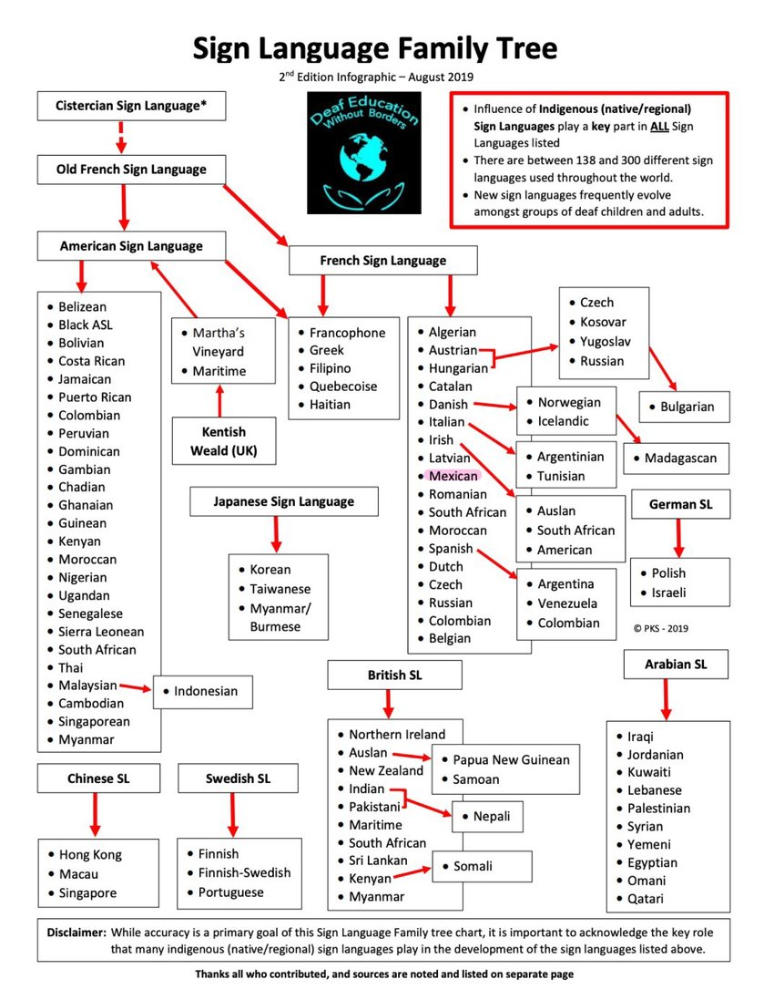
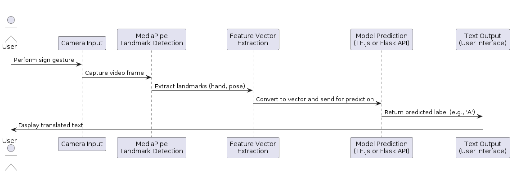

# Moonshot Project Report

## Table of Contents

<details>
<summary>Click to expand</summary>

- [Moonshot Project Report](#moonshot-project-report)
  - [Table of Contents](#table-of-contents)
  - [I. Introduction](#i-introduction)
  - [II. Problem Statement](#ii-problem-statement)
  - [III. Project Overview](#iii-project-overview)
    - [Project Description](#project-description)
    - [Target Users](#target-users)
    - [Contexts of Use](#contexts-of-use)
    - [Added Value and Impact](#added-value-and-impact)
  - [IV. Functional Specifications](#iv-functional-specifications)
    - [1. Core Feature: Sign-to-Text Translation](#1-core-feature-sign-to-text-translation)
    - [2. Target Users](#2-target-users)
    - [3. Interaction Flow](#3-interaction-flow)
    - [4. Accessibility Considerations](#4-accessibility-considerations)
  - [V. Technical Specifications](#v-technical-specifications)
    - [1. Sign Recognition Pipeline Overview](#1-sign-recognition-pipeline-overview)
    - [2. Technology Stack](#2-technology-stack)
    - [3. MediaPipe Landmark Detection](#3-mediapipe-landmark-detection)
    - [4. Model Training via Teachable Machine](#4-model-training-via-teachable-machine)
      - [Training Process](#training-process)
    - [5. Performance and Limitations](#5-performance-and-limitations)
  - [VI. Software Architecture](#vi-software-architecture)
    - [1. Architecture Overview](#1-architecture-overview)
    - [2. Frontend (Client-Side)](#2-frontend-client-side)
    - [3. Backend (Server-Side)](#3-backend-server-side)
    - [4. Model Integration](#4-model-integration)
    - [5. Data Flow Diagram](#5-data-flow-diagram)
    - [6. API Overview](#6-api-overview)
  - [VII. Algorithm and Model Design](#vii-algorithm-and-model-design)
    - [1. Chosen Algorithm and Frameworks](#1-chosen-algorithm-and-frameworks)
    - [2. Training Methodology](#2-training-methodology)
    - [3. Performance Evaluation](#3-performance-evaluation)
    - [4. Strengths and Limitations](#4-strengths-and-limitations)
  - [VIII. Testing Strategy](#viii-testing-strategy)
    - [1. Current Testing Status](#1-current-testing-status)
      - [Manual Tests Performed](#manual-tests-performed)
    - [2. Planned Testing Types](#2-planned-testing-types)
      - [a. **Unit Testing**](#a-unit-testing)
      - [b. **Model Validation Testing**](#b-model-validation-testing)
      - [c. **Usability Testing (Planned)**](#c-usability-testing-planned)
      - [d. **Performance Testing**](#d-performance-testing)
    - [3. Test Environments](#3-test-environments)
    - [4. Limitations of Current Testing](#4-limitations-of-current-testing)
    - [5. Future Goals](#5-future-goals)
  - [IX. Project Management](#ix-project-management)
    - [1. Methodology Used](#1-methodology-used)
    - [2. Timeline and Planning](#2-timeline-and-planning)
    - [3. Challenges Encountered and How They Were Managed](#3-challenges-encountered-and-how-they-were-managed)
      - [a. **Technical Complexity of Sign Language Learning**](#a-technical-complexity-of-sign-language-learning)
      - [b. **Technical Complexity of Gesture Recognition**](#b-technical-complexity-of-gesture-recognition)
      - [c. **Time Constraints**](#c-time-constraints)
      - [d. **Tool Limitations**](#d-tool-limitations)
      - [e. **Lack of Real-User Testing**](#e-lack-of-real-user-testing)
  - [X. Future Developments](#x-future-developments)
    - [1. Dynamic Sign Recognition](#1-dynamic-sign-recognition)
      - [Planned Enhancements](#planned-enhancements)
    - [2. Mobile Application Development](#2-mobile-application-development)
      - [Planned Stack](#planned-stack)
    - [3. Expanded Vocabulary and Real-Life Scenarios](#3-expanded-vocabulary-and-real-life-scenarios)
      - [Examples](#examples)
    - [4. Learning and Feedback Features](#4-learning-and-feedback-features)
      - [Potential Features](#potential-features)
    - [5. User Testing and Collaboration](#5-user-testing-and-collaboration)
      - [Plans](#plans)
  - [XI. Conclusion](#xi-conclusion)

</details>

## I. Introduction

In France, approximately 200,000 people are completely deaf, and many more are hard of hearing. For many of them, French Sign Language (LSF) is the primary means of communication. Yet, despite its importance, LSF remains marginalized — it is not officially recognized as a language by the French government, and is not taught in schools as foreign languages like English or Spanish are.

This lack of formal recognition creates a significant communication gap between the deaf and hearing populations. While some individuals do learn LSF, it is far from widespread. As a result, deaf people often struggle to communicate effectively in key situations — particularly in administrative, medical, or social contexts — where LSF interpreters are not always available, especially outside of major cities.

To cope, many rely on written communication, which can be frustrating, limited, and far from inclusive.

This project aims to help bridge that gap by developing a mobile application that translates French Sign Language (LSF) into text and vice versa, using machine learning models for real-time translation. The goal is to empower deaf individuals to communicate more easily and independently in their daily lives.

You might wonder why existing tools, like Google Translate or other sign language apps, are not used instead. The reason is simple: most of them do not support LSF. They typically focus on American Sign Language (ASL), or occasionally Indian Sign Language (ISL), and cannot be reliably used in the French context.



As shown above, sign languages differ greatly across countries. Even those with shared roots — like French Sign Language (LSF) and Belgian French Sign Language (LSFB) — have distinct grammar, vocabulary, and cultural contexts. A tool built for ASL or BSL cannot simply be adapted to LSF without risking significant inaccuracies.

Some innovative solutions like [SignAll](https://signall.world/) exist, but they are mainly targeted at ASL and do not offer support for LSF. This is where my project comes in — to create a solution tailored to the needs of French signers.

I chose this project because I’ve always wanted to use my technical skills to make a real impact. I believe this app can improve the daily lives of many deaf individuals in France, while also allowing me to explore fields I’m passionate about: machine learning, mobile development, and digital accessibility.

## II. Problem Statement

As mentioned in the introduction, the core issue is the persistent communication gap between deaf individuals who use French Sign Language (LSF) and the hearing population. This gap is deepened by the lack of official recognition and widespread teaching of LSF in France, which limits the ability of most hearing people to understand or use the language.

Many deaf individuals depend on sign language interpreters to navigate essential services. However, interpreters are expensive, not always available, and generally concentrated in major cities. In rural or less populated regions, access is often nonexistent, leaving deaf individuals isolated in critical moments such as medical consultations, administrative procedures, or everyday social interactions.

While there are some existing tools in France, such as [Keia](https://www.keia.io/), an AI-based solution that translates written content from government or insurance websites into LSF videos, these solutions focus on static, one-way translation of formal content. They do not support real-time, bidirectional communication for day-to-day conversations.

This project aims to fill that gap by developing a mobile application capable of real-time translation between LSF and written French. By leveraging machine learning to recognize and translate sign language gestures, the application will enable more inclusive, accessible, and autonomous communication for deaf individuals in a variety of everyday situations.

## III. Project Overview

The goal of this project is to develop a mobile application that bridges the communication gap between deaf and hearing individuals in France by enabling real-time translation between French Sign Language (LSF) and written French.

### Project Description

The application is designed as an assistive communication tool for deaf users, allowing them to interact more independently and fluidly in daily situations where LSF is not understood by the people around them. It will include the following core features:

- **Sign-to-Text Translation**: Users perform signs in front of the camera, and the app recognizes the gesture and displays its meaning in written French.
- **Text-to-Sign Translation**: Users input text or speech, and the app returns the equivalent LSF gesture, using either animations or sign videos.

> [!NOTE]
> Regarding my scholar project, I will focus on the sign-to-text translation feature, as it is the most complex and technically challenging part of the application, according to my research and discussions with experts in the field.

### Target Users

This application is primarily designed for:

- **Administrative and Medical Professionals**: To facilitate communication with deaf clients or patients who use LSF.
- **Deaf Individuals Able to Use LSF**: To empower them to communicate more effectively in everyday situations, such as shopping, asking for directions, or attending appointments.
  Note than the app is intended to help them, so the person that might use it is not the deaf individual, but rather the hearing person who needs to communicate with them.
- **Companies and Organizations**: To improve inclusivity in customer service, healthcare, and public services by enabling staff to communicate with deaf clients.

> [!NOTE]
> Since the law [n° 2005-102 from February 11, 2005](https://www.legifrance.gouv.fr/jorf/id/JORFTEXT000000809647?isSuggest=true) mandates accessibility for people with disabilities, including those who are deaf or hard of hearing, this app can help organizations comply with these requirements.

### Contexts of Use

The app is intended to be used in various contexts, including:

- **Medical Settings**: During consultations, check-ups, or emergencies where communication with healthcare professionals is essential.
- **Administrative Offices**: For tasks like filling out forms, understanding procedures, or asking questions in government offices.
- **Public Services**: In places like banks, post offices, or public transportation where deaf individuals need to interact with staff who may not know LSF.
- **Social Interactions**: In everyday situations like shopping, dining, or asking for help in public spaces, even if I don't plan to focus on this part of the application.

### Added Value and Impact

Compared to existing tools that focus on American Sign Language (ASL) or static content translation (mainly an alphabet and that's it), this application offers a **real-time, LSF-specific** solution tailored to the **cultural and linguistic context of France**. It promotes:

- Greater autonomy for deaf individuals
- Increased public awareness of LSF
- Improved inclusivity in essential services

By focusing specifically on French Sign Language and real-life interaction, this project aims to make a meaningful social and technological contribution.

## IV. Functional Specifications

The application is designed to facilitate communication between deaf individuals who use French Sign Language (LSF) and hearing individuals who do not understand it. While the final product will include multiple features, this academic project will focus primarily on the most technically challenging component: **Sign-to-Text Translation**.

### 1. Core Feature: Sign-to-Text Translation

This feature enables users to perform signs in front of their device’s camera. The app captures the gesture and uses a machine learning model to recognize the sign and convert it into written French.

The sign-to-text module will initially support a limited set of static signs, starting with the LSF alphabet. As the system evolves, support for dynamic signs and full expressions will be added.

### 2. Target Users

This feature is primarily intended for **hearing individuals** who need to understand what a deaf person is signing in real time. The key user groups include:

- **Family members and friends** of deaf individuals who do not know LSF.
- **Administrative personnel** (e.g., in town halls, social services, or banks) who interact with the public.
- **Medical professionals**, such as doctors, nurses, or pharmacists, who need to communicate quickly and clearly with patients.

Although the feature can be used by deaf individuals themselves, they are not the primary users in this context. The goal is not to teach LSF to the world, but rather to **equip hearing people with a tool that enables them to understand deaf signers** more effectively and respectfully.

### 3. Interaction Flow

The typical interaction for this feature will follow these steps:

1. The hearing person opens the app on their phone or tablet.
2. The deaf person signs a word or letter in front of the camera.
3. The app analyzes the gesture and displays the corresponding French word or character in real time.

### 4. Accessibility Considerations

To ensure usability for a wide range of users, the app will include:

- A clean and intuitive interface with large buttons and high-contrast visuals.
- Support for both portrait and landscape modes to adapt to different devices.
- Minimal setup steps to enable fast communication in critical moments (e.g., medical emergencies).

Future versions may include additional accessibility options, such as adjustable text size, voice output for translated signs, or offline usage for low-connectivity areas.

## V. Technical Specifications

This section focuses on the technical implementation of the sign recognition component of the application, which is the core of this project. The goal is to recognize static hand gestures (initially the LSF alphabet) using computer vision and machine learning.

### 1. Sign Recognition Pipeline Overview

The sign recognition system consists of the following stages:

1. **Image Capture**: The app accesses the device’s camera and captures frames of the user performing signs.
2. **Landmark Detection**: MediaPipe is used to extract hand, face, and body landmarks in real time.
3. **Feature Extraction**: The 3D coordinates of key landmarks are transformed into a flat vector.
4. **Classification**: A machine learning model, trained via Google Teachable Machine and exported in TensorFlow.js format, classifies the gesture based on the landmark data.

### 2. Technology Stack

| Component             | Tool / Library                | Purpose                                |
| --------------------- | ----------------------------- | -------------------------------------- |
| Landmark Detection    | MediaPipe (Python)            | Detect hand and body keypoints         |
| Model Training        | Google Teachable Machine      | Train a classifier using landmark data |
| Model Inference       | TensorFlow.js (for prototype) | Run trained model in browser or app    |
| Dataset Format        | CSV / JSON                    | Exported landmark data per sign        |
| Visualization & Debug | OpenCV (Python)               | Visual feedback during prototyping     |

### 3. MediaPipe Landmark Detection

MediaPipe’s holistic model is used to detect 33 pose landmarks, 21 hand landmarks per hand, and 468 face landmarks. The relevant data for static sign recognition are primarily the **hand landmarks**, but face and body orientation can also be included to improve accuracy and reduce false positives.

Here is a simplified Python snippet used for real-time landmark extraction:

```python
import cv2
import mediapipe as mp

mp_hands = mp.solutions.hands
hands = mp_hands.Hands(static_image_mode=False, max_num_hands=1)
mp_draw = mp.solutions.drawing_utils

cap = cv2.VideoCapture(0)

while True:
    success, image = cap.read()
    image_rgb = cv2.cvtColor(image, cv2.COLOR_BGR2RGB)
    result = hands.process(image_rgb)

    if result.multi_hand_landmarks:
        for handLms in result.multi_hand_landmarks:
            mp_draw.draw_landmarks(image, handLms, mp_hands.HAND_CONNECTIONS)

    cv2.imshow("LSF Sign Detection", image)
    if cv2.waitKey(1) & 0xFF == ord('q'):
        break
```

The extracted landmarks (x, y, z coordinates) are stored and labeled to create a dataset used for model training.

### 4. Model Training via Teachable Machine

Google Teachable Machine was chosen for training the first prototype because of its simplicity and ability to export TensorFlow\.js models.

#### Training Process

- Images are captured with labeled hand signs (A–Z).
- Landmarks are extracted and converted into a feature vector.
- A classifier is trained using a simple neural network.
- The model is exported in `.json` (architecture) and `.bin` (weights) formats for direct use in web or mobile apps.

Although Teachable Machine does not provide control over hyperparameters or architecture depth, it allows for **fast iteration** and **deployment-ready models**, which suits early-stage prototyping.

### 5. Performance and Limitations

- **Accuracy** (prototype): \~90% on well-lit, static backgrounds for distinct letters.
- **Limitations**:

  - Sensitive to hand positioning and camera angle.
  - Only supports **static signs** — dynamic gesture recognition (e.g., movement-based signs) is not yet supported.
  - Background noise and lighting variation reduce model reliability.

These limitations will be addressed in future iterations through:

- Data augmentation techniques.
- Collection of dynamic sign sequences and use of temporal models (e.g., LSTM or 3D CNN).
- Enhanced pre-processing to normalize hand orientation and scale.

## VI. Software Architecture

This section presents the intended architecture of the application, as designed during the planning phase. It is important to note that the full software architecture described here is **theoretical** and has not yet been fully developed or implemented. It serves as a foundation for future development.

### 1. Architecture Overview

The project follows a **client–server architecture**, where the frontend (mobile or web app) handles user interaction and input capture, and the backend is responsible for processing the data and running the model (or serving predictions from a pre-trained model).

This architecture has been designed but is not yet deployed. The current focus of the project is on the development of the sign recognition prototype.

### 2. Frontend (Client-Side)

- Intended to be built using **React Native** for mobile compatibility.
- Will handle camera access to capture video of hand gestures.
- Will display model predictions (textual output).
- As of now, this interface exists only as a conceptual design.

### 3. Backend (Server-Side)

- Designed to be implemented in **Flask (Python)**.
- Will expose API endpoints for prediction and processing.
- Not yet developed — currently, no backend is running.

### 4. Model Integration

Two theoretical deployment strategies have been considered:

- **Client-side inference** using **TensorFlow.js** for offline prediction.
- **Server-side inference** via a Flask API for centralized processing.

Neither option has been implemented yet, but both are technically feasible.

### 5. Data Flow Diagram



This diagram represents the planned flow of data once the system is developed.

### 6. API Overview

| Endpoint          | Method | Description                                   | Status          |
| ----------------- | ------ | --------------------------------------------- | --------------- |
| `/predict`        | POST   | Receives landmark data and returns prediction | Planned         |
| `/health`         | GET    | Returns API status                            | Planned         |
| `/log` _(future)_ | POST   | Logs usage data or errors                     | Conceptual only |

## VII. Algorithm and Model Design

This section details the design of the sign recognition model and its training methodology. While some prototyping has been conducted using MediaPipe and Google Teachable Machine, the complete pipeline remains **theoretical at this stage**. Only partial experimentation has been done, and no finalized system is in production yet.

### 1. Chosen Algorithm and Frameworks

The recognition model is based on a simple **neural network classifier**, trained using **Google Teachable Machine**. It takes as input the 3D coordinates of hand landmarks detected by MediaPipe.

This approach was selected for its accessibility and speed of prototyping, though it remains at the experimentation stage.

### 2. Training Methodology

- A preliminary dataset of static hand signs (A–Z) was created using sample captures.
- MediaPipe was used to extract landmark positions.
- A small model was trained using the Teachable Machine interface.
- The resulting TensorFlow.js model has not yet been fully integrated into any application.

This methodology is currently being explored, and the results are not finalized.

### 3. Performance Evaluation

Some basic testing was performed manually, using live webcam input and previewing model outputs.

- **Validation accuracy**: ~90% on controlled input.
- **Real-world accuracy**: Unmeasured — no structured test suite exists yet.
- **Latency**: Acceptable in browser (~0.5–1s), not yet tested on mobile.

These results are preliminary and meant to guide future iterations.

### 4. Strengths and Limitations

**Strengths (in theory):**

- Lightweight and fast inference.
- Compatible with mobile and web platforms.
- Requires minimal hardware.

**Limitations (current state):**

- No support for dynamic gestures.
- Model accuracy is sensitive to environment.
- Pipeline not fully integrated or tested in a real app.

These observations are based on early experiments and serve to inform future development stages. The goal is to incrementally validate this architecture and training strategy through iterative testing and implementation.

## VIII. Testing Strategy

This section outlines the current and planned testing efforts related to the sign recognition component of the application. Given that the project is still in an early prototype phase, most tests remain theoretical or exploratory. However, they establish a foundation for more structured evaluation in future iterations.

### 1. Current Testing Status

At this stage, no automated test suite has been implemented. Only **manual testing** has been conducted using the webcam and the browser-based interface provided by Google Teachable Machine.

#### Manual Tests Performed

- Live gesture classification using pre-trained model.
- Accuracy observed under different lighting conditions and hand positions.
- Real-time responsiveness and latency evaluated visually.

These tests provided basic feedback on the model’s strengths and limitations, but did not involve quantitative validation or reproducible benchmarks.

### 2. Planned Testing Types

Once the system progresses beyond the prototyping stage, the following testing strategies will be applied:

#### a. **Unit Testing**

- For any preprocessing or data handling scripts (e.g., landmark normalization, API data formatting).
- Implemented in Python using `unittest` or `pytest`.

#### b. **Model Validation Testing**

- Evaluate model performance using a **labeled test dataset**.
- Key metrics:
  - **Accuracy**
  - **Precision / Recall**
  - **Confusion Matrix** (to identify commonly misclassified signs)
- Models will be validated on both training and unseen users to evaluate generalization.

#### c. **Usability Testing (Planned)**

- Engage a small group of users (both deaf and hearing) to interact with the app prototype.
- Focus on ease of use, clarity of output, and communication efficiency.
- Collect qualitative feedback through short interviews or surveys.

#### d. **Performance Testing**

- Measure latency for:
  - Webcam input to prediction result (client-side inference).
  - Network delay if using server-side prediction.
- Test on different devices (mobile vs. desktop) for compatibility and speed.

### 3. Test Environments

| Environment         | Status        | Description                                |
| ------------------- | ------------- | ------------------------------------------ |
| Teachable Machine   | Used          | Web-based model training and live testing  |
| Local Python Script | Partial       | MediaPipe landmark extraction in real time |
| React Native App    | Not developed | Planned for mobile integration             |
| Flask Backend API   | Not developed | Placeholder for future server deployment   |

### 4. Limitations of Current Testing

- No dataset versioning or automated validation.
- No reproducibility of test cases due to manual execution.
- No quantitative error tracking or logging implemented yet.

### 5. Future Goals

To mature the testing process, the following goals are planned:

- Build a labeled dataset for systematic validation.
- Implement a structured test pipeline for model training.
- Deploy a testable web or mobile interface with basic logging.
- Include accessibility testing with real users from the deaf community.

This progressive strategy ensures that testing scales with the technical growth of the project while remaining user-centered and inclusive.

## IX. Project Management

This section outlines how the project was planned and managed throughout its development cycle. As a solo project conducted within the context of a bachelor’s degree program, the focus was on iterative prototyping and goal-oriented planning, rather than formal team-based workflows.

### 1. Methodology Used

I adopted a **lightweight Agile-inspired approach**, primarily focused on flexibility and rapid iteration. While I did not follow a strict Scrum or Agile process, I organized my work into short development cycles with clear, achievable objectives.

Each cycle focused on a specific task or milestone, such as:

- Learning LSF basics
- Creating and collecting gesture samples
- Setting up MediaPipe scripts
- Training and testing the prototype model

This iterative method allowed me to adapt as new challenges or technical constraints emerged.

I tried to document as much as possible my progress via monthly reports, which helped me stay organized and reflect on my learning journey. The reports included:

- My research phase about my moonshot ideas, project goals, and initial planning. [See the first reports](./MontlyRecap/1_Research/)
- My documentation of t

### 2. Timeline and Planning

The project was structured into four major phases:

| Phase                        | Description                                                         |
| ---------------------------- | ------------------------------------------------------------------- |
| **Research & Ideation**      | Exploration of LSF, existing tools, user needs                      |
| **Documentation & Planning** | Defining functional specs, technical requirements, and architecture |
| **Technical Discovery**      | Learning MediaPipe and testing Google Teachable Machine             |
| **Prototype Development**    | Building scripts, collecting data, training simple model            |
| **Testing**                  | Preparing report, testing basic flows, planning future steps        |

### 3. Challenges Encountered and How They Were Managed

#### a. **Technical Complexity of Sign Language Learning**

- **Challenge**: Understanding the nuances of LSF and its grammar, which is quite different from spoken French.
- **Response**: I started with to learn the LSF with Com'Signes, an association, composed of deaf people, that offers classes and resources for learning LSF.

#### b. **Technical Complexity of Gesture Recognition**

- **Challenge**: Learning computer vision and machine learning techniques without prior experience.
- **Response**: Focused on static signs for the prototype to reduce complexity and used Teachable Machine to simplify model training.

#### c. **Time Constraints**

- **Challenge**: Balancing academic requirements, personal learning, and development goals within a short period.
- **Response**: Prioritized building a functional core (sign-to-text recognition) instead of over-extending the feature set.

#### d. **Tool Limitations**

- **Challenge**: Limited control over model architecture using Teachable Machine.
- **Response**: Treated current tools as temporary solutions, with plans to move to TensorFlow/Keras for future custom models.

#### e. **Lack of Real-User Testing**

- **Challenge**: No direct access to deaf users or sign language experts during development.
- **Response**: Designed the app with public LSF standards and open feedback loops for future testing rounds.

---

This flexible, self-managed approach allowed me to stay focused on meaningful deliverables and adapt the project scope as needed. While not formally structured like an industry Agile team, the process was aligned with the goals of fast iteration, learning, and progressive development.

## X. Future Developments

Although the current project focuses on static sign recognition using the LSF alphabet, there are several key directions for future development that will significantly enhance the scope, usability, and real-world impact of the application.

### 1. Dynamic Sign Recognition

One of the most important next steps is to move beyond static gesture classification and begin supporting **dynamic signs**, which involve motion over time (e.g., directional gestures, repeated movements, or transitions between hand shapes).

#### Planned Enhancements

- **Motion Tracking**: Implement a recording system capable of capturing short video sequences (instead of single frames) with timestamped landmark data.
- **Temporal Modeling**: Train models using techniques like:
  - **Recurrent Neural Networks (RNNs)** or **LSTM** to handle time-series data.
  - **3D Convolutional Neural Networks (3D CNNs)** for spatiotemporal analysis.
- **Dataset Expansion**: Collect dynamic gesture samples, labeled with motion annotations.

These changes will allow the application to understand full signs (not just letters), leading to more natural, fluid communication.

### 2. Mobile Application Development

To increase accessibility and usability, a full **mobile version** of the application is planned. The prototype is currently desktop-based or browser-bound, but real-world usage requires portability.

#### Planned Stack

- **Frontend**: React Native (cross-platform for iOS and Android).
- **Camera Integration**: Native device camera API for gesture capture.
- **Offline Support**: Embedded model with TensorFlow Lite or TensorFlow.js for local predictions.
- **Simple UX**: Streamlined interface tailored for use in real-time conversations (large buttons, voice output, minimal menus).

### 3. Expanded Vocabulary and Real-Life Scenarios

Beyond the alphabet, the application should gradually support full words and phrases relevant to daily interactions.

#### Examples

- Context-specific vocabularies: “at the doctor”, “at the bank”, “shopping”.
- Preloaded signs for emergency expressions.
- A mode for **guided conversations**, where users can select topics or phrases visually.

### 4. Learning and Feedback Features

In the long term, the application could also serve as a **learning platform** for both hearing and deaf users.

#### Potential Features

- Sign recognition accuracy feedback.
- Gamified learning (e.g., quizzes, challenges).
- Progress tracking for learners of LSF.

### 5. User Testing and Collaboration

As the project evolves, involving real users will be critical.

#### Plans

- **Collaborate with LSF teachers or institutions** to validate signs and interactions.
- **Test with deaf individuals** to refine accessibility and user interface.
- **Create feedback channels** within the app to collect user insights and error reports.

---

These future developments aim to transform the current prototype into a robust, inclusive, and impactful tool that supports real-life communication between deaf and hearing individuals. By expanding both the **technical capabilities** and **user focus** of the application, the project has the potential to evolve into a valuable public resource.

## XI. Conclusion

Through those 3 years, I have learned a lot more than I could ever imagine. This project has been a journey of discovery, not only in the technical aspects of machine learning and mobile development but also in understanding the profound impact that technology can have on people's lives.

During these period, I developped contacts, I learned new skills such as LSF, python and more specifically MediaPipe, and I gained a deeper appreciation for the challenges faced by the deaf community in France. I am excited about the potential of this application to make a real difference in their daily lives.

I am grateful for the support and guidance I received from my professors, mentors, and peers throughout this process. Their insights and encouragement have been invaluable in shaping this project. I look forward to continuing this work, expanding the application's capabilities, and ultimately contributing to a more inclusive society where communication barriers are minimized. The journey is just beginning, and I am eager to see where it leads.
