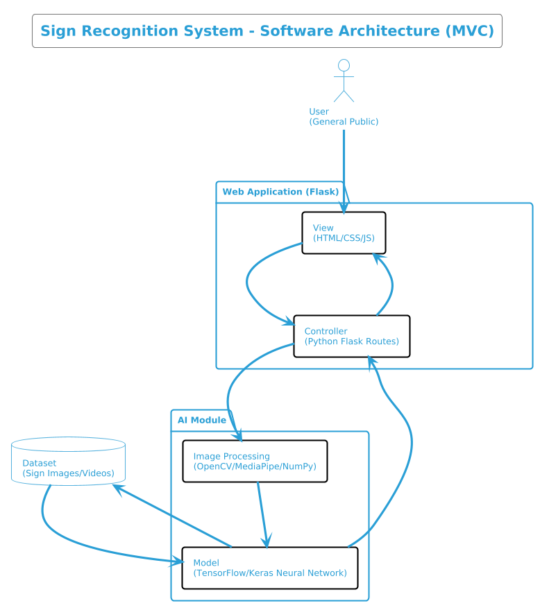

# Technical Specifications

## Table of Contents

<details><summary>Click to expand</summary>

- [Technical Specifications](#technical-specifications)
  - [Table of Contents](#table-of-contents)
  - [Introduction](#introduction)
    - [Objectives](#objectives)
    - [Why this project?](#why-this-project)
  - [Scope](#scope)
  - [Task Management](#task-management)
  - [Technologies Used](#technologies-used)
    - [Software Architecture](#software-architecture)
    - [File and Folder Structure](#file-and-folder-structure)
      - [Breakdown](#breakdown)

</details>

## Introduction

This project is a complementary project to my scholarship. It is a sign recognition system that uses a neural network to recognize signs in images. The project is divided into two parts: the first part is the training of the neural network, and the second part is the implementation of the system in a web application. The target audience for this project is the general public, and the goal is to make it easy to use and accessible to everyone. The project is being developed in Python, and the web application is being developed using Flask. The project is being developed in a modular way, so that each part can be developed and tested independently. The project is being developed using the Agile methodology, with a focus on continuous integration and continuous deployment.

### Objectives

The main objective of this project is to develop a sign recognition system that can recognize signs in images, and later in videos, as French Sign Language is mainly based on gestures. The system should be able to recognize signs in real time, and should be able to provide feedback to the user. The system should also be able to learn from the user's input, so that it can improve its accuracy over time. The system should be easy to use, and should be accessible to everyone. The system should also be able to run on a variety of devices, including smartphones, tablets, and computers.

### Why this project?

The main reason for this project is to help deaf people communicate with hearing people, more specifically, in the administration. The project aims to provide a tool that can help deaf people communicate with hearing people.

## Scope

The project is divided into two main parts:

1. The AI model, which is responsible for recognizing signs in images and videos.
2. The web application, which is responsible for providing a user interface for the AI model.

| Item            | In Scope                                                                                      | Out of Scope                                                                                                                                      |
| --------------- | --------------------------------------------------------------------------------------------- | ------------------------------------------------------------------------------------------------------------------------------------------------- |
| AI model        | Ability to recognize signs in images and videos <br> Be accurate as possible (99.5% accuracy) | Ability to learn from the user's input <br> Ability to provide feedback to the user                                                               |
| Web application | Ability to provide a user interface for the AI model <br> Use user's camera                   | Ability to be a sign language learning tool <br> Ability to provide a sign language dictionary <br> Ability to provide a sign language translator |

The project is being developed in Python, the AI model is being developed using TensorFlow and Keras.

## Task Management

The project will be divided into several tasks, each task will be really small and will be developed in a modular way. Here's a list of the tasks that will be developed in the project:

- [x] Task 1: Learn how to use TensorFlow and Keras
- [x] Task 2: Create a simple program that can recognize body parts
- [x] Task 3: Create a simple program that can record images from the camera
- [x] Task 4: Train the AI model to recognize signs
- [x] Task 5: Create a simple program that can recognize signs from webcam
- [ ] Task 6: Find a way to train the AI model with videos signs and not only images
- [ ] Task 7: Create a simple program that can recognize signs from videos
- [ ] Task 8: Create a simple program that can recognize signs from videos and images
- [ ] Task 9: Create an application that is easy to use and accessible to everyone
- [ ] Task 10: Link the AI model with the web application
- [ ] Task 11: Train an AI to write French properly as the LSF syntax is different from the French syntax

The first part of the project should be completed by the second week of June 2025, and the second part of the project should be completed by the end of June 2027, both are theoretical deadlines for the exam.

The project is being developed in a modular way, so that each part can be developed and tested independently.

## Technologies Used

The project is being developed using the following technologies:

- Python for the main programming language
- TensorFlow and Keras for the AI model
- Flask for the web application
- HTML, CSS, and JavaScript for the front-end
- MediaPipe, OpenCV and NumPy for the image processing

Using the least amount of technologies possible is a priority for this project, as it will make the project easier to maintain and develop. It's the reason why I chose to use Flask for the web application, as it is a lightweight framework that is easy to use and understand.

### Software Architecture

The software architecture of the sign recognition system is organized into three core components:

- **The Web Application**, developed with **Flask**, provides the user interface where users can access the camera, view real-time predictions, and interact with the recognition system.
- **The AI Model**, built with **TensorFlow** and **Keras**, performs the actual recognition of signs using image or video input.
- **The Image Processing Module**, using **MediaPipe**, **OpenCV**, and **NumPy**, prepares visual input for prediction by detecting and extracting relevant features such as hand gestures or body parts.

Here's an overview of the high-level software architecture:

> 

The architecture is based on the **Model-View-Controller (MVC)** design pattern. The **View** is the front-end of the application, built with HTML, CSS, and JavaScript, which captures camera input and displays prediction results to the user. The **Controller**, implemented as Flask routes, manages the flow of data between the front end and the back end.

When a user accesses the application, the **Controller** activates the **Image Processing Module**, which captures and analyzes input from the user's webcam. This data is then passed to the **AI Model**, which has been pre-trained to recognize specific signs from the dataset.

The **Model** returns its prediction, and the **Controller** sends this result back to the **View**, updating the interface in real time. The system is designed to be modular and scalable, allowing for independent testing and future expansion—such as support for real-time video input, French grammar correction, and additional sign languages.

This modular approach ensures:

- Clear separation of concerns between components
- Easier testing and maintenance
- Scalability for features like continuous learning or cross-device support

### File and Folder Structure

The project directory will follow a modular structure, organized for clarity and maintainability:

```plaintext
ALGOSUP-MOONSHOT-PROJECT/
├── app/
│   ├── static/
│   │   ├── css/
│   │   └── js/
│   ├── templates/
│   │   └── index.html
│   ├── controllers/
│   │   └── routes.py
│   ├── model/
│   │   ├── train.py
│   │   ├── predict.py
│   │   └── model.h5
│   ├── processing/
│   │   ├── capture.py
│   │   └── preprocess.py
│   └── __init__.py
├── dataset/
│   └── signs/
│       ├── A/
│       ├── B/
│       └── ...
├── tests/
│   └── test_model.py
├── run.py
├── requirements.txt
├── README.md
└── .gitignore
```

> [!NOTE]
> The `model/` folder contains training scripts and the saved model file (`model.h5`). The `processing/` folder contains logic for capturing and preprocessing input. The `controllers/` folder holds the Flask routing logic.

#### Breakdown

- **app/**: Core application logic

  - **static/**: Front-end assets (CSS, JS)
  - **templates/**: HTML templates
  - **controllers/**: Flask route handlers (Controller in MVC)
  - **model/**: AI model training and prediction logic
  - **processing/**: Image preprocessing and capture modules

- **dataset/**: Training data organized by sign categories
- **tests/**: Unit tests for AI and system logic
- **run.py**: Entry point for the Flask server
- **requirements.txt**: Project dependencies
